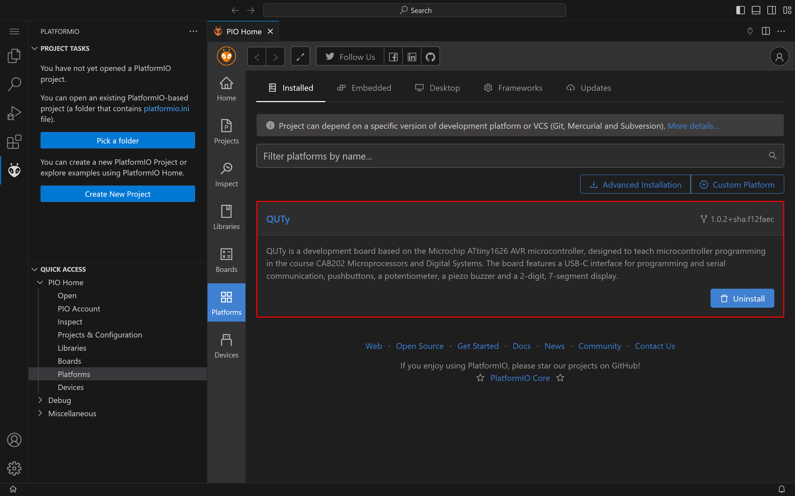
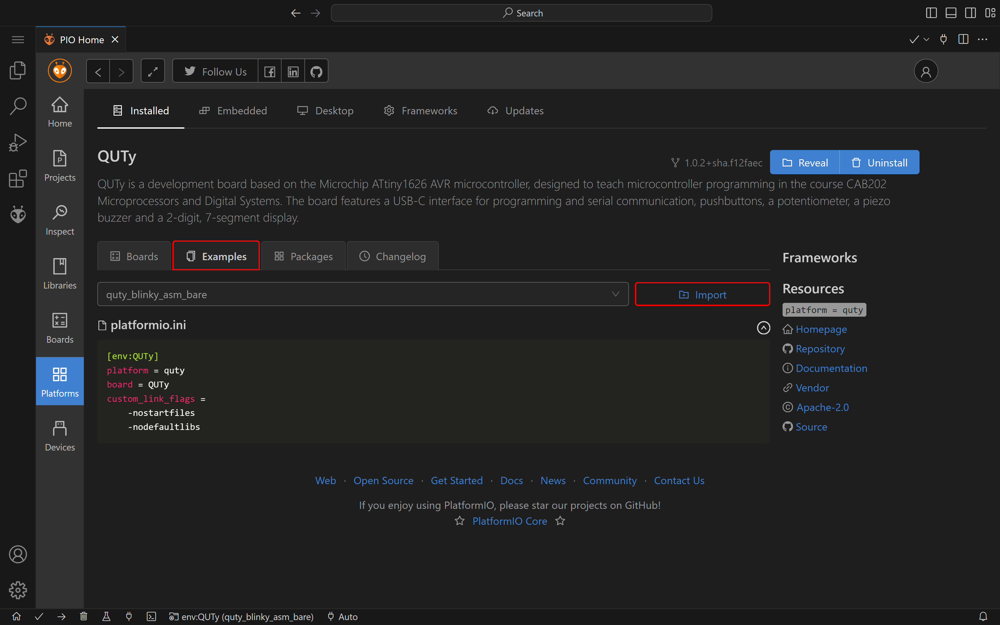
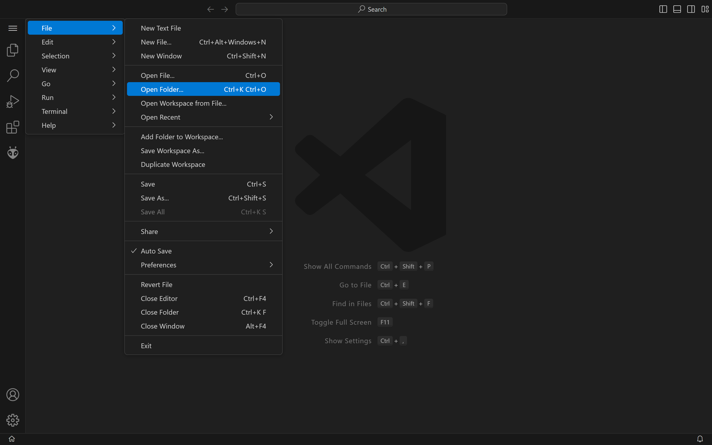
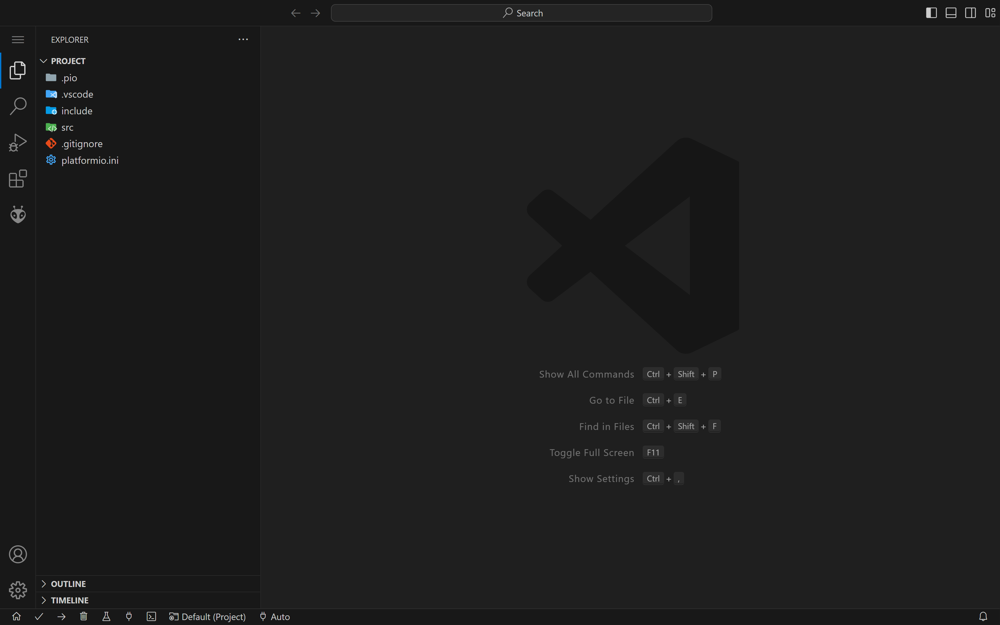
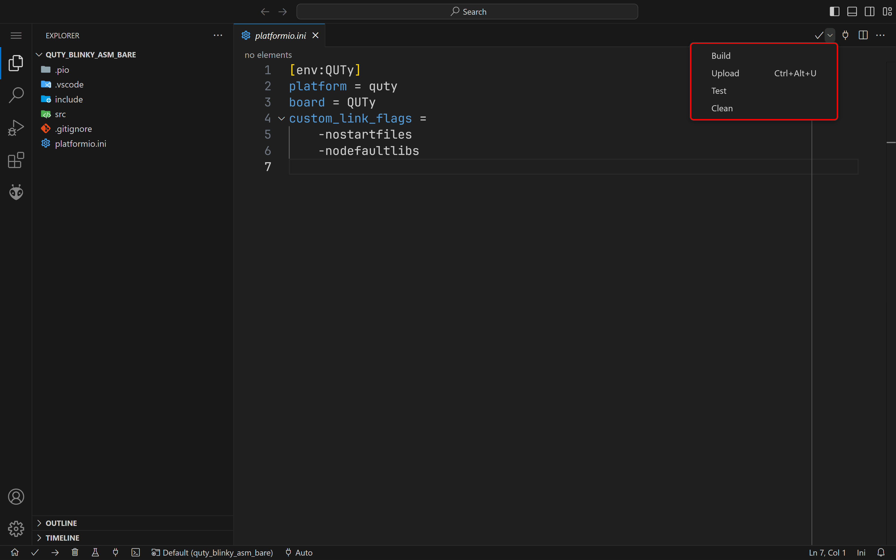

# 1.1. Installation

To setup VSCode for development on the QUTy Microcontroller board,
follow the installation steps found on the [QUTy Development Board](https://cab202.github.io/quty/) website.

Users who wish to perform a CLI installation should refer to
[CLI Usage](https://cab202.github.io/quty/cli).

## Verifying Installation

To verify that the QUTy platform has been installed correctly, navigate
to the PlatformIO Platforms tab, and ensure that the QUTy platform is
listed.



## Verifying Driver Installation

To verify that the QUTy board is able to interface with a host machine,
connect the device using a USB cable. Then navigate to the PlatformIO
Devices tab, and ensure a device with the description "Silicon Labs
CP210x USB to UART Bridge" is listed.

The specific PORT name may vary depending on the host machine and the
number of devices connected.


## Opening a Project

### Opening an Example Project

The QUTy platform offers some examples to test compilation and driver
compatability. To access these examples, click on the QUTy platform and
open the Examples tab. Select the desired example and click on the
Import button to clone the project to the local machine.



### Opening an Existing Project

To open an existing project in VSCode, it is important to ensure that
the following directory structure is maintained:

```go
project root/
├───.pio/ (generated by PlatformIO)
│   └───build/
│       └───QUTy/
├───include/
│   └───<header files>
├───lib/
│   └───<pre-compiled programs>
├───src/
│   └───<source files>
└───platformio.ini
```

To open this project correctly in VSCode, select **Open Folder** and
navigate to the **root directory** of the project.



The explorer view should now display the project structure as shown below:



## PlatformIO Toolbar

After opening a project, PlatformIO will automatically configure the
build flags required for compilation when it detects the
`platformio.ini` file in the workspace root. This will reveal the
following toolbar on the top-right corner of the VSCode window:



These options perform the following actions:

1. **Build** - Assembles/Compiles the project.
2. **Upload** - Assembles/Compiles the project and uploads the firmware to the microcontroller.
3. **Test** - Runs the test suite for the project (not available for the QUTy platform).
4. **Clean** - Removes the compiled binaries from the `.pio` directory. This can be useful when debugging build issues.
